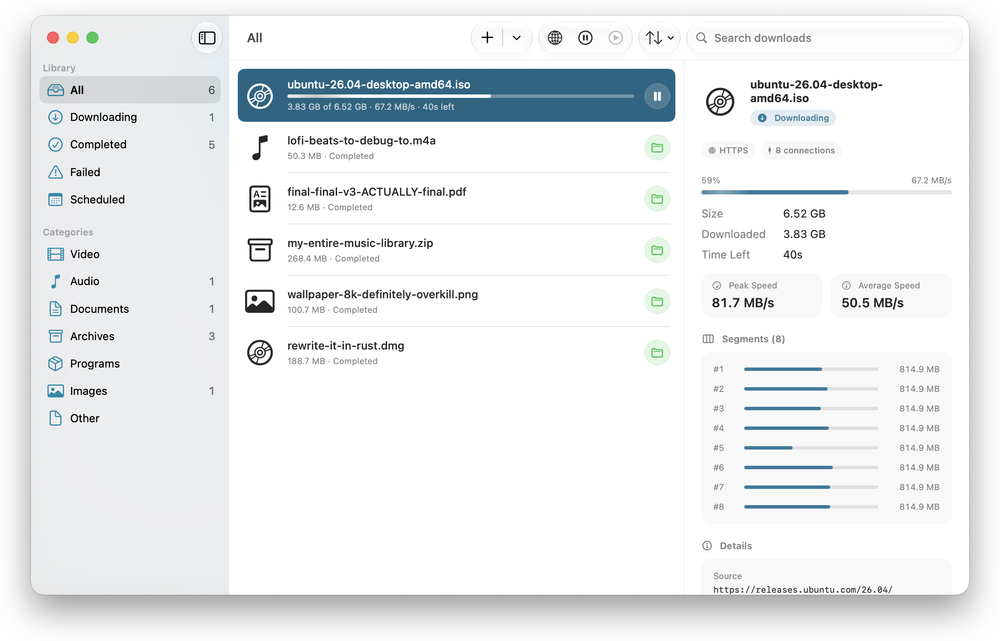

# CloakDrop

**A fast, private, multi-segment download manager for macOS — that feels like Apple made it.**

Serious multi-segment download power with the look and feel of a first-party app. The app shell is
native SwiftUI—not Electron or a web-powered UI—and WebKit is used only for the built-in browser.
There is no telemetry, account, or CloakDrop service receiving your activity.

<p align="center">
  <a href="LICENSE"></a>
  
  
  
  
</p>

<p align="center">
  <picture>
    <source srcset="assets/screenshots/hero-readme.webp" type="image/webp">
    
  </picture>
</p>

> Part of the **[Cloakyard](https://github.com/cloakyard)** privacy-first suite, alongside **CloakPDF**, **CloakIMG**, and **CloakResume**.

---

## 📥 Download & release timeline

**[⬇️ Download the beta](https://github.com/cloakyard/cloakdrop/releases)** · Apple silicon · grab the `.dmg` from the newest release

CloakDrop is in **active development**. The beta is a complete, usable app — but it is *not* notarized yet, so macOS will not open it on a double-click: **right-click the app ▸ Open** the first time, then it launches normally forever after.

| | |
|---|---|
| 🧪 **Beta — now** | Rolling pre-release, rebuilt as features land. Unsigned by Apple's notary service; the same tested engine is used by beta and stable builds. |
| 🍎 **Stable — with macOS 27 Golden Gate** | The first Developer ID-signed, **notarized** build is timed to Golden Gate's final release, not to a date of our own. |

**Why wait for Golden Gate?** CloakDrop already targets **macOS 26 or later** and uses its native
Liquid Glass APIs. The current release plan is to cut the first notarized 1.0 alongside the final
macOS 27 release, after testing the same app on that finished OS.

**Why Apple silicon only?** CloakDrop's release app and bundled helper builds are intentionally
**arm64-only**. There is no Intel or universal release build.

## ✨ What it does

| | |
|---|---|
| 🧵 **Adaptive multi-segment downloads** | Automatic mode starts from the configurable default (8), adds connections for very large files, and stays within the configured maximum (16 by default, adjustable up to 32). You can override the connection count per download. Strict HTTP range/identity validation, FTP `REST` capability probing, bounded rolling scheduling, and tail work-stealing keep useful connections busy; a server that ignores or misreports ranges is restarted safely as one stream. |
| 🔌 **HTTP, HTTPS & FTP/FTPS** | One engine, many transports — a native FTP/FTPS client (over Network.framework: EPSV/PASV, `REST` resume, implicit TLS for `ftps`) segments and resumes just like HTTP, with no bundled library. |
| ⏯️ **True pause & resume** | Persisted byte-range progress survives app relaunch and reboot. Resume continues from the last saved offsets; if size/ETag/range validation detects that the remote representation changed, CloakDrop discards incompatible staging data and restarts cleanly instead of mixing versions. |
| 🔁 **Auto-recovery** | Per-segment retry with exponential backoff + jitter; auto-pauses when the network drops and resumes when it returns. |
| ✅ **Integrity & trust** | When checksum verification is enabled (the default), MD5 / SHA-1 / SHA-256—from a checksum you supply or a same-origin sibling `.sha256`/`.sha1`/`.md5`—is tested against private staging data before an ordinary file is exposed at its final path. Optional, offline code-signature validation covers recognizable `.app`/`.dmg` code objects; it does not claim a notarization verdict. |
| 🧾 **Provenance Receipt** | When enabled (the default), completed ordinary file downloads get a local, exportable record containing the requested source, configured mirrors, encrypted-transport flag, whole-file SHA-256, and available checksum/code-signature verdicts. |
| 🐢 **Bandwidth control** | Global **and** per-download speed limits (a GCRA throttle that holds the aggregate cap honestly under many concurrent connections), plus optional time-of-day profiles. |
| 🗂️ **Queues, categories & rules** | Per-queue concurrency limits, smart filters, a rule-based routing engine (folder / queue / speed cap / auto-start), duplicate detection, and auto-sorting of finished files into per-type folders. |
| 📦 **Post-processing** | Native ZIP auto-extraction (Zip-Slip + decompression-bomb guarded), a Gatekeeper quarantine flag on saved files, and an optional all-downloads-finished action (notify / quit / run a Shortcut). |
| 📋 **Effortless capture** | Clipboard watching, drag & drop, a link-grabber (paste mixed links or **grab all** from a page → dedupe → pattern-expand `file[01-50].zip` → pick), scheduler, Keychain-backed HTTP/FTP auth, cookies/referrer, and system/manual proxy. |
| 🌐 **Built-in browser** | A WebKit browser inside the app (⇧⌘B): visit any site and a live badge lists the video, audio, and files on the page (HLS/DASH manifests, direct files, `attachment` responses) — deduped down to the one thing worth grabbing and titled by the page, with ads, tracking beacons, and stream chunks filtered out (players hidden in shadow DOM still found). IDM-style, it **takes over downloads** the moment a page starts one. Streams open a quality picker so you choose the resolution; logged-in grabs carry your cookies. An optional **ad & tracker blocker** (off by default, in Settings ▸ Browser) drops ad/tracker requests and ad pop-ups on nearly every site via a compiled WebKit content-rule list — with a choice of blocklist: the built-in curated one, or an open-source list (OISD Small, StevenBlack Hosts, Peter Lowe's) downloaded on demand and updatable with one click. Plus a Share Extension and a "Send to CloakDrop" Services item for capture from other apps. |
| 🎬 **Media grabbing** | Detects HLS (`.m3u8`) and DASH (`.mpd`) streams, lists qualities, decrypts AES-128, and pairs a chosen video rendition with a resolvable audio track—muxed into a clean, playable file with no re-encode (AVFoundation → `.mp4`/`.m4a`; bundled ffmpeg stream-copies VP9/AV1/Opus → `.mkv`). Selected, successfully resolved subtitle tracks are written as sidecar `.srt` files; audio-only grabs are repackaged losslessly into `.m4a` for AAC or another compatible audio container. |
| 🎥 **Site & video extraction** | Paste a YouTube link into **New Download** — or any of the **~1800 sites** yt-dlp knows — and CloakDrop recognizes the video page, resolves its formats, and grabs them with **its own** segmented engine: the best quality straight away, or a resolution picker when *Ask which quality* is on. yt-dlp contacts the page/service only to resolve metadata and media URLs; it never downloads the selected media payload, so that transfer's pause/resume and persistence stay CloakDrop's. |
| 🪞 **Multi-source mirrors** | Open a Metalink (`.metalink` / `.meta4`) and CloakDrop spreads segments across its mirrors, rejects invalid range/size responses and detected same-origin ETag changes, and fails over between sources. When checksum verification is enabled (the default), a supplied whole-file Metalink checksum is tested against staging data before publication. |
| 🏅 **Download stats** | Local, private lifetime totals — today / this month / all-time — with a playful monthly tier badge that resets each month (Warming Up → ISP's Worst Nightmare). Just counters on your Mac; nothing leaves the device. |
| 🏎️ **Built-in speed test** | Speedometer-style dials measure your connection's real download, upload, idle/loaded latency, and jitter — multi-connection, warm-up-aware, and strictly manual. Cloudflare by default, Ookla optional; reachable from the menu bar. |
| 🌍 **Fully localized** | Every UI string translated into 11 languages (English, Spanish, French, German, Simplified Chinese, Japanese, Korean, Brazilian Portuguese, Russian, Arabic, Hindi). |
| 🪟 **Native to the bone** | SwiftUI + Liquid Glass, light/dark appearance, VoiceOver labels and keyboard access, a live menu-bar extra, and a Dock icon that shows overall progress at a glance. |

## 🛡️ Privacy first

CloakDrop has no telemetry, analytics beacons, update checks, or other phone-home traffic. Network activity is limited to downloads and features you initiate or configure: the URLs, redirects, and mirrors used by your transfers; optional same-origin checksum-file discovery; video-page metadata resolution through yt-dlp; pages and subresources loaded by the built-in browser; address-bar queries submitted to your selected search engine on Return; your system or manually configured proxy; speed tests you start; and open-source blocklists you explicitly select or update. Scheduled transfers and automatic resume can continue work you configured earlier.

- **On-device only** — no accounts, no analytics, no crash reporting, no phone-home.
- **A browser that forgets** — the built-in browser keeps cookies and site data so logins persist, but records **no browsing history**, and offers a one-click wipe of all site data.
- **Your data stays yours** — download history and settings live in a local SQLite database, with controls to remove records, clear completed items, and reset statistics.
- **Sandboxed** — App Sandbox limits access to CloakDrop's containers, the standard Downloads folder, and destinations you explicitly select.
- **Transparent** — read the [full privacy policy](PRIVACY.md), with an in-app summary under Settings ▸ Privacy.

## 🧰 Tech stack

| Area | Choice |
|---|---|
| Language | Swift 6 with **strict concurrency** (`complete`) |
| UI | SwiftUI — native Liquid Glass on **macOS 26 or later**, with focused AppKit/WebKit bridges for browser and system integration |
| Engine | Actor-based — a `DownloadManager` actor driving one `DownloadTask` actor per transfer, with an explicit bounded connection budget |
| Networking | `URLSession` (strict HTTP Range/identity validation with bounded backpressure) + a native **Network.framework FTP/FTPS** client behind one `HTTPClient` protocol seam, both driving segmentation, resume & multi-source (Metalink mirror) spread + failover |
| Persistence | GRDB (SQLite); remembered site/proxy secrets in the **Keychain**, with per-download request state in the local database for resume |
| Integrity | CryptoKit (checksums) + Security framework (code-signature trust, Provenance Receipt) |
| Media | AVFoundation for passthrough remux/mux (HLS/DASH → clean `.mp4`/`.m4a`) with a bundled ffmpeg fallback for VP9/AV1/Opus (→ `.mkv`), plus poster-frame thumbnails |
| Extraction | A bundled, code-signed **yt-dlp** page→formats resolver (YouTube + ~1800 sites); it may contact the submitted page/service endpoints, while CloakDrop's engine downloads the selected media payload |
| Capture | A built-in WebKit browser (first-party media sniffing + download takeover), plus Share/Services bridged through a shared App Group inbox |
| Build | XcodeGen (`project.yml` → `.xcodeproj`), SwiftLint |

No third-party Swift dependencies beyond GRDB. Two native command-line tools are bundled as
code-signed, sandboxed helpers via opt-in build scripts
(`apps/macos/scripts/fetch-ffmpeg.sh`, `apps/macos/scripts/fetch-ytdlp.sh`): **ffmpeg** only transforms
local media and has no network support in the bundled build; **yt-dlp** may contact a video page and
related service endpoints to resolve metadata and media URLs, but it never transfers the selected
media payload. CloakDrop's engine downloads that payload.

## 🚀 Getting started

Requires **macOS 26+**, **Xcode 26+**, [XcodeGen](https://github.com/yonaskolb/XcodeGen), and an **Apple silicon** Mac.

This repo is a **monorepo**; the native macOS app lives in `apps/macos/` (the brand site is in `apps/site/`).

```bash
brew install xcodegen                  # one-time
git clone https://github.com/cloakyard/cloakdrop.git
cd cloakdrop/apps/macos                # the macOS app lives here
xcodegen generate                      # generate the (git-ignored) Xcode project
open CloakDrop.xcodeproj                # …or build from the command line:
```

```bash
xcodebuild -project CloakDrop.xcodeproj -scheme CloakDrop -destination 'platform=macOS' build
```

The `.xcodeproj` is generated and git-ignored — regenerate it any time with `xcodegen generate`. To package a shareable installer DMG (drag-to-Applications, with an install guide), run `scripts/dmg/make-dmg.sh <path/to/CloakDrop.app>` from `apps/macos/`. Released builds are published as [GitHub Release](https://github.com/cloakyard/cloakdrop/releases) assets — the DMG never lives in the repo.

## 🧪 Testing

The engine is UI-agnostic and fully tested in isolation — no GUI required:

```bash
cd apps/macos/Packages/DownloaderCore
swift test
```

**528 tests across 75 suites** cover the core end-to-end: automatic and manual connection planning,
bounded parallel scheduling and reassembly, **resume across a simulated relaunch**, strict range and
resource-identity validation, safe single-stream fallback, retry-after-drop, dynamic tail
re-splitting, bounded HTTP/FTP buffering, rolling HLS/DASH work, Metalink spread + mirror failover,
pre-publication checksum verification, destination collision/non-overwrite safety, AES-128 media
decryption, native FTP over a loopback server, GCRA bandwidth capping, ZIP extraction (Zip-Slip +
bomb rejection), video-page recognition, and real loopback HTTP downloads.

Normal test runs make no public-network requests. Maintainers can opt into production-path smoke tests
against caller-selected HTTP(S) origins:

```bash
CLOAKDROP_LIVE_TEST_URLS='https://origin.example/file,https://another.example/file' \
  swift test --filter LiveOriginSmokeTests
```

## 🏗️ Project layout

```
cloakdrop/                      # monorepo root
├── apps/
│   ├── macos/                  # The native macOS app (this project)
│   │   ├── App/                # Thin SwiftUI app shell (CloakDrop target)
│   │   │   ├── App/            #   @main entry, AppModel, environment
│   │   │   ├── Features/       #   Sidebar · DownloadList · Inspector · AddDownload · Browser · Settings
│   │   │   ├── Ambient/        #   MenuBarExtra · Dock progress · Notifications
│   │   │   └── Shared/         #   Formatters, icons, shared views
│   │   ├── ShareExtension/     # macOS share-sheet capture
│   │   ├── scripts/            # Opt-in helpers: fetch-ffmpeg.sh · fetch-ytdlp.sh (bundle & sign the native tools) · dmg/ (build the installer DMG) · generate_app_icon.swift (exports flattened fallbacks from the native Icon Composer document) · validate_localizations.py
│   │   └── Packages/
│   │       └── DownloaderCore/ # Headless, UI-agnostic, fully unit-tested core
│   │           ├── DownloadModels/       # Sendable value types + HLS/DASH & Metalink parsers + stats, link-grabber, bandwidth-schedule & provenance models
│   │           ├── DownloadPersistence/  # GRDB store behind a protocol
│   │           └── DownloadEngine/       # Actors, segmentation, HTTP + native FTP/FTPS networking, checksums, Keychain credentials, archive extraction, media, yt-dlp resolver
│   └── site/                   # CloakDrop brand site (Astro → Cloudflare Workers, drop.cloakyard.com)
├── assets/                     # Shared brand assets (logo · icons · social card · screenshots)
└── README · LICENSE · CLAUDE.md · CONTRIBUTING · SECURITY · CODE_OF_CONDUCT
```

The brand (`CloakDrop`) lives only at the repo root and the app target; the reusable core is named for the **downloader** domain. See [ARCHITECTURE.md](apps/macos/ARCHITECTURE.md) for the full design.

## 🤝 Contributing

Contributions are welcome — please read [CONTRIBUTING.md](CONTRIBUTING.md) and our [Code of Conduct](CODE_OF_CONDUCT.md). To report a security issue, see [SECURITY.md](SECURITY.md).

## 📄 License

Released under the [MIT License](LICENSE). Built by Sumit Sahoo as part of [Cloakyard](https://github.com/cloakyard).
